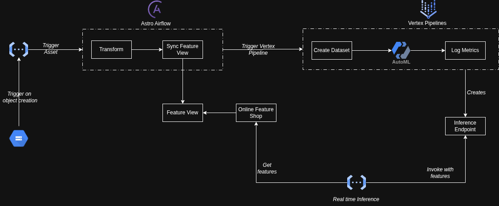

# End-to-End MLOps Reference Architecture on GCP

Production-grade reference architecture for building, training, evaluating, and deploying machine learning models on Google Cloud Platform using OpenTofu, BigQuery, Airflow, Vertex AI, and Vertex AI Feature Store.

This repository demonstrates a complete MLOps workflow using the Kaggle Credit Card Fraud Detection dataset.

---

## Overview

This project implements an automated, event-driven MLOps architecture that:

1. Provisions infrastructure using OpenTofu  
2. Ingests and transforms data with Airflow and BigQuery  
3. Preserves lineage using BigQuery snapshots  
4. Trains and evaluates models with Vertex AI Pipelines and AutoML  
5. Deploys models conditionally based on performance thresholds  
6. Serves real-time predictions via Cloud Function  
7. Retrieves online features from Vertex AI Feature Store  

The system supports continuous retraining and automated model promotion.

---

## Architecture

### End-to-End Flow

1. Data lands in GCS.  
2. Airflow triggers on object creation/update.  
3. Load data into raw BigQuery table.  
4. Transform raw to training table.  
5. Create immutable snapshot for lineage.  
6. Sync Feature View.  
7. Trigger Vertex AI Pipeline.  
8. Vertex Pipeline:
   - Create dataset from snapshot  
   - Train using AutoML  
   - Evaluate metrics  
   - Deploy if threshold is met  
9. Cloud Function:
   - Accept card_number  
   - Fetch features  
   - Invoke endpoint  
   - Return prediction  

---

## Architecture Diagram

---

## Infrastructure as Code (OpenTofu)

OpenTofu provisions:

- BigQuery datasets and tables  
- Snapshot tables  
- Service accounts and IAM bindings  
- Cloud Function  
- Vertex AI Feature Store and Feature View  
- Vertex pipeline components  

Infrastructure is declarative and reproducible.

---

## Data Pipeline (Airflow)

Triggered by GCS object events.

Pipeline steps:

1. Load data into raw table  
2. Transform into training table  
3. Snapshot training table  
4. Sync Feature View  
5. Trigger Vertex Pipeline  

Snapshots ensure dataset immutability and reproducibility.

---

## Model Training and Deployment (Vertex AI)

Vertex Pipeline:

1. Create dataset from snapshot  
2. Train with AutoML  
3. Evaluate performance  
4. Deploy to endpoint if metrics meet threshold  

Enables automated and controlled model promotion.

---

## Online Inference Architecture

Cloud Function serves predictions:

1. Accept card_number  
2. Retrieve features from Feature Store  
3. Call Vertex endpoint  
4. Return fraud prediction  

Ensures training-serving feature consistency.

---

## Dataset

Kaggle Credit Card Fraud Detection dataset.

- Binary classification  
- Highly imbalanced  
- Used to simulate fraud detection workflow  

---

## Production Readiness Callouts

Before production deployment, address the following:

### 1. Least Privilege IAM

- Avoid project-wide roles  
- Scope permissions narrowly  
- Separate service accounts by responsibility  
- Remove unused permissions  

### 2. Canary Model Deployment

- Use traffic splitting on Vertex Endpoint  
- Gradually shift traffic  
- Monitor before full rollout  

### 3. Model Monitoring

- Enable Vertex Model Monitoring  
- Track feature and prediction drift  
- Configure alerts  

### 4. Optimize Online Feature Store

- Configure for burst traffic  
- Tune scaling and latency  
- Load test inference path  

---

## Continuous MLOps Capabilities

- Event-driven retraining  
- Automated evaluation and promotion  
- Immutable datasets for lineage  
- Offline and online feature consistency  
- Infrastructure as Code  
- Modular pipeline design  

---

## Prerequisites

- GCP project  
- OpenTofu installed  
- gcloud CLI configured  
- Python 3.10+  
- Airflow environment  
- Vertex AI, BigQuery, and Cloud Functions APIs enabled  

---

## Security Considerations

- Enable CMEK if required  
- Restrict network egress  
- Enable audit logging  
- Avoid long-lived service account keys  
- Use VPC Service Controls if needed  

---

## Design Principles

- Infrastructure as Code  
- Immutable datasets  
- Event-driven orchestration  
- Automated governance  
- Reproducibility  

---

## Future Enhancements

- CI/CD for pipelines  
- Blue/Green deployment  
- Automated rollback  
- Feature governance workflows  
- Cost monitoring  

---

This repository serves as a reference implementation for scalable, production-ready MLOps on GCP. It is intended as a foundation and should be hardened appropriately before enterprise deployment.
